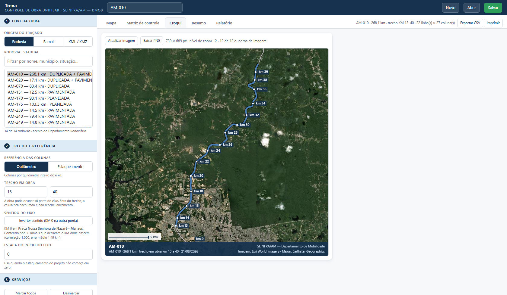

# Trena

**Controle de obra unifilar — SEINFRA/AM · Departamento de Mobilidade**

Trena porque é o que ela faz: mede ao longo do eixo, quilômetro a quilômetro.

Plataforma para controlar obra rodoviária **quilômetro a quilômetro**, em rodovias estaduais
e ramais do Amazonas. O usuário escolhe o eixo (do acervo do Departamento Rodoviário ou de um
KMZ/KML próprio), a plataforma divide o traçado do KM 0 até a extensão final, e cada serviço
passa a ser lançado por quilômetro e por lado da pista — a mesma lógica da planilha
`SEINFRA_CONTROLE AM-010`, sem planilha.

Página única, sem etapa de compilação e sem servidor de aplicação: abre no navegador e lê os
dados da pasta `dados/`. Nada é enviado para fora da máquina — o KMZ do usuário é lido pelo
próprio navegador e o projeto fica no `localStorage` até ser salvo em arquivo.



## O que ela faz

| | |
|---|---|
| **Divisão por quilômetro** | Distância geodésica real (Vincenty sobre o GRS-80), não comprimento em graus. Cada segmento fecha em 1 km cheio; o último recebe a sobra. |
| **Estaqueamento** | As colunas alternam entre KM e estaca (1 estaca = 20 m, logo o KM 1 abre na estaca 50), com estaca inicial configurável quando o projeto não começa em zero. |
| **Trecho em obra** | A obra pode ocupar só parte do eixo. Fora do trecho a célula fica hachurada e não recebe lançamento. |
| **Serviços por lado** | Dois catálogos da planilha da SEINFRA — recuperação (12 serviços, padrão AM-010) e implantação (9 serviços, padrão AM-070) — cada serviço com os lados que fazem sentido (único, faixa direita/esquerda, acostamento direito/esquerdo). |
| **Croqui em satélite** | Imagem do trecho sobre imagem de satélite, gerada na hora, com marcação de quilômetro, escala e crédito — para quem lê o relatório se localizar. |
| **Relatório** | Localização do trecho, avanço geral, situação por serviço, detalhamento por faixa e notas técnicas, pronto para imprimir ou salvar em PDF pelo navegador. |
| **Acervo base** | 34 rodovias estaduais (3.456,7 km de traçado, dos quais **1.146,6 km implantados**) e 905 ramais (6.262,1 km), do cadastro do Departamento Rodoviário. |
| **Implantado x planejado** | O cadastro registra trecho que ainda não existe no chão. A plataforma separa os dois: diz quanto do eixo é implantado e em que quilômetros está o planejado. |

## Como abrir

A plataforma lê arquivos JSON da pasta `dados/`, e o navegador bloqueia isso em `file://`.
Rode um servidor local na raiz do projeto:

```
python -m http.server 8000
```

e abra `http://localhost:8000`. Publicada no GitHub Pages, abre direto pela URL.

## Estrutura

```
index.html                       a página: HTML, CSS e a marcação da interface
app/
  00-estado.js                   estado do projeto em memória
  01-motor.js                    geodésia, costura do traçado e divisão por quilômetro
  02-arquivos.js                 leitura de KMZ e KML
  03-acervo.js                   acervo, catálogo de serviços e seleção do eixo
  04-mapa.js                     mapa de localização
  05-croqui.js                   croqui do trecho sobre imagem de satélite
  06-matriz.js                   matriz de lançamento por quilômetro e lado
  07-relatorio.js                relatório e exportação em CSV
  08-persistencia.js             salvar, reabrir e localStorage
  09-app.js                      montagem da interface e eventos
bibliotecas/
  leaflet-1.9.4/                 mapa e croqui
  jszip-3.10.1/                  descompactação do KMZ
dados/
  acervo-rodovias-estaduais.json 34 rodovias, traçado simplificado e sentido do eixo
  acervo-ramais.json             905 ramais
  catalogo-servicos.json         serviços, lados e status (cores e códigos)
ferramentas/
  gerar-acervo.py                monta os acervos a partir das camadas do DMOB
  testar-motor.mjs               prova o cálculo fora do navegador (node)
  testar-interface.py            opera a interface num Chromium e grava as capturas
  testar-fluxos.py               prova KMZ, KML, salvar/reabrir, CSV, estaca e ramal
  testar-modulos.mjs             prova a carga dos dez módulos: ordem, globais e símbolos
  conferir-acervo-vs-cadastro.py compara o acervo com a Planilha Geral do Departamento
  testar-sentido-por-ramal.py    mede o KM 0 contra o KM que os ramais declaram
documentacao/
  MANUAL-DE-USO.md               passo a passo para quem vai usar
  imagens/                       capturas da plataforma em operação
referencia/                      planilha de controle da SEINFRA que originou o catálogo
                                 (fica só na máquina: não vai para o repositório)
```

Os dez módulos de `app/` são carregados em ordem por `<script>` no `index.html`: não há
empacotador, não há etapa de compilação, e o que está no arquivo é o que roda no navegador.

## Sem internet

O Leaflet e o JSZip ficam em `bibliotecas/`, servidos da própria pasta, e não vêm de CDN.
Não é preferência de estilo: em obra no interior do Amazonas o sinal cai, e uma plataforma
que só abre online não serve para medir quilômetro no campo. Do mesmo modo, o acervo é lido
de `dados/` e o projeto fica no `localStorage` — nada depende de servidor. Só a imagem de
satélite do croqui precisa de rede; sem ela, o croqui sai com fundo neutro (ver o fim deste
arquivo).

## Implantado e planejado não se somam

Dos 3.456,7 km de traçado do acervo, **1.146,6 km são implantados** — o resto existe no
cadastro e não no chão. Treze rodovias não têm um único trecho implantado (AM-170, AM-175,
AM-280, AM-326, AM-329, AM-336, AM-343, AM-356, AM-360, AM-366, AM-374, AM-378, AM-466), e
duas são mistas: a **AM-254** tem 166,5 km implantados de 307,5, e a **AM-363**, 120,6 de
333,4.

Isso não é detalhe de cadastro: **recuperação se mede onde há pista**. Uma AM-326 aberta como
se tivesse 106 km de rodovia daria uma matriz de 107 colunas para medir serviço em estrada
que não foi construída. O acervo grava, para cada eixo, `km_implantado` e a faixa de KM de
cada trecho com sua situação; o seletor mostra quanto é implantado e a tela avisa onde está o
planejado.

Rodovia planejada **continua no acervo e continua abrindo** — é justamente nela que se
controla obra de **implantação**, com o catálogo de serviços da AM-070. O que a plataforma
não faz é deixar a extensão total passar por extensão de obra.

## Sobre o KM 0

O sentido do eixo não é detalhe de desenho: se o KM 0 estiver na ponta errada, todo
lançamento aponta para o lugar errado da rodovia. O acervo registra, para cada eixo, **como**
o sentido foi determinado, e a plataforma mostra isso ao lado do seletor:

| Fonte do sentido | Rodovias | O que significa |
|---|---|---|
| Cadastro + ramais | 3 | Ordem dos trechos no Sistema Rodoviário Estadual, conferida contra os ramais |
| Ramais | 9 | Amarração de três ou mais ramais que declaram em que KM da rodovia nascem, por correlação |
| Ramais (poucos pontos) | 4 | Um ou dois ramais: não há correlação, mas o KM declarado cai onde o eixo diz numa das pontas e erra grosso na outra |
| Cadastro | 2 | Ordem dos trechos, sem ramal para conferir |
| Entroncamento | 13 | Localização, na geometria, do entroncamento que o cadastro dá como início |
| Não verificável | 3 | Trecho único, sem ramal amarrado e sem entroncamento localizável |

Restam **três** rodovias sem sentido verificado — AM-175, AM-280 e AM-329, todas planejadas —
e nelas a plataforma avisa. Eram sete: **AM-170, AM-239 e AM-249 tiveram o KM 0 confirmado**
pela posição dos ramais que declaram o KM onde nascem, e a **AM-374 estava com o KM 0 na ponta
errada** — três ramais declaram km 91,8, 93,23 e 96,5, e o eixo os media a 5,5, 4,9 e 2,3 km
do início; invertida, o erro médio cai para 0,33 km. O traçado dela foi corrigido no acervo.

O botão **Inverter sentido** troca a ponta do KM 0 em qualquer eixo — inclusive num KMZ
carregado pelo usuário, que nunca traz essa informação.

Nos ramais o cadastro traz a coordenada de origem (`ponto_inicio`), e ela coincide com o
primeiro vértice do traçado nos 905 casos: o KM 0 do ramal é o entroncamento, como deve ser.

## Como isto foi conferido

Duas provas rodam por fora e não dependem de conferência visual:

```
node ferramentas/testar-motor.mjs               # cálculo: geodésia, segmentação, sentido do eixo
python ferramentas/testar-interface.py         # interface num Chromium de verdade (--ver regrava as capturas)
python ferramentas/conferir-acervo-vs-cadastro.py   # acervo x cadastro do Departamento Rodoviário
```

As duas primeiras conferem o projeto contra si mesmo. A terceira confere contra
**fonte de fora**: a Planilha Geral do Departamento Rodoviário, mantida pelo órgão e
que é o documento que o Estado declara ao DNIT. Ela existe porque o
`gerar-acervo.py` lê a mesma origem para a geometria e para a extensão declarada —
as camadas do DMOB —, e um registro errado sai daí **auto-consistente**: a geometria
mede o que o cadastro embutido afirma, e nada discorda. Só uma segunda fonte pega.

**33 dos 34 eixos fecham** dentro de algumas dezenas de metros. A exceção é a
**AM-326**, e não é erro de medida: o cadastro do órgão diz 27,84 km terminando em
**Urucará**, e o traçado que o acervo carrega mede 106,21 km terminando em
**Urucurituba**. Há dois códigos em circulação para a mesma rodovia — `326EAM2784` e
`326EAM1062`, com a extensão no próprio sufixo —, e a geometria do shapefile do DNIT
mede 27,79 km com a etiqueta de 106,29 km. A pergunta que decide é de campo: a
AM-326 termina em Urucará ou em Urucurituba? Enquanto não se decidir, quem abrir a
AM-326 no Trena recebe uma matriz de 107 colunas. Hoje isso não afeta medição de
obra — a rodovia é leito natural nas duas fontes.

O que elas medem, no acervo real:

- 1 grau de latitude no equador = 110,574 km; Manaus–Brasília = 1.934 km.
- Uma linha sintética de 10 km sai em 10 segmentos de 1 km, com desvio máximo abaixo de 1 m.
- A soma dos segmentos bate com a extensão do acervo em **todas** as 34 rodovias — pior
  diferença 6,0 m, na AM-010, sobre 268 km.
- A AM-010 fecha em 268,062 km de geometria contra 268,250 km de cadastro (0,07%).
- Descontinuidade no traçado encerra o segmento em vez de emendar por cima do vazio.
- O KM 0 da AM-010 está a 1,4 km do centro de Manaus e o fim a 175 km, em Itacoatiara.
- 294 de 297 ramais (99,0%) começam no entroncamento com a rodovia que declaram como
  referência — conferência independente do sentido dos dois acervos.
- A interface opera sem um único erro de console: acervo, matriz de 5.918 células,
  lançamento por clique, recorte de trecho, estaqueamento, croqui em satélite, relatório e
  filtro de ramais.

## Regenerar o acervo

```
python ferramentas/gerar-acervo.py
```

Lê `Projetos DMOB\SEINFRA\geojson_base\` (rodovias estaduais, rodovias federais e ramais),
costura os trechos, orienta o eixo, simplifica o traçado com tolerância de 11 m e grava os
dois JSON. O script imprime o método de sentido de cada rodovia e as inconsistências que
encontra no cadastro de origem — na última execução, o KM declarado nos ramais da **AM-326**
(erro médio 68,7 km) e da **AM-363** (28,2 km) não fecha com a geometria, e a amarração
desses dois foi descartada.

## Imagem de satélite

O fundo é o **Esri World Imagery**, usado com atribuição na própria imagem. Não são usados
tiles do Google: não há API pública para uso em aplicação própria e o acesso direto contraria
os termos de uso. A resolução na Amazônia é equivalente. Se o tile não vier — sem internet ou
bloqueado —, o croqui sai com fundo neutro: perde a foto, não o traçado.

---

SEINFRA/AM — Departamento de Mobilidade (DMOB).
