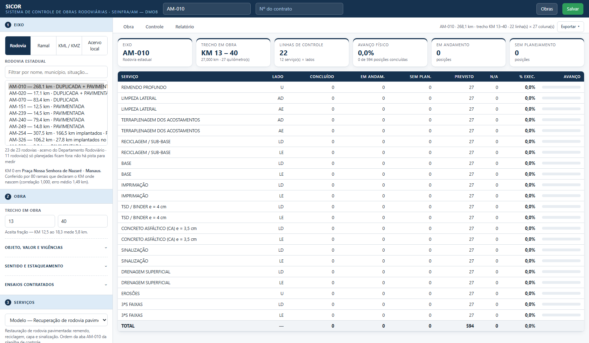

# Manual de uso — SICOR

Sistema de Controle de Obras Rodoviárias

SEINFRA/AM · Departamento de Mobilidade

Este manual é para quem vai operar a plataforma. A parte técnica (como o acervo é gerado, como
o cálculo é conferido) está no [README](../README.md).

---

## 1. Abrir a plataforma

Publicada no GitHub Pages, basta abrir a URL. Rodando na máquina, abra o terminal na pasta do
projeto e execute:

```
python -m http.server 8000
```

Depois abra `http://localhost:8000` no navegador. Se a plataforma for aberta com dois cliques
no `index.html`, ela avisa e não carrega: o navegador bloqueia a leitura da pasta `dados/` em
`file://`.

Nada é enviado para fora da máquina. O que você lança fica gravado no navegador e volta
sozinho na próxima abertura.

---

## 2. Escolher o eixo da obra


Na coluna da esquerda, bloco **1 — Eixo da obra**, há três origens:

- **Rodovia** — as 34 rodovias estaduais do cadastro do Departamento Rodoviário.
- **Ramal** — os 905 ramais, com filtro por nome, município ou rodovia de referência.
- **KML / KMZ** — arraste o arquivo do seu projeto. O arquivo é lido pelo próprio navegador.

Ao escolher, a plataforma divide o traçado do KM 0 até a extensão final e desenha no mapa. O
campo de filtro aceita nome, município ou situação (por exemplo, `manacapuru` ou `pavimentada`).

### Confira o KM 0

Abaixo do botão **Inverter sentido** a plataforma diz de onde vem o KM 0 daquele eixo — por
exemplo: *«KM 0 em Praça Nossa Senhora de Nazaré – Manaus. Conferido por 80 ramais que declaram
o KM onde nascem (correlação 1,000, erro médio 1,49 km)»*.

Quando aparecer **«Sentido não verificado»**, olhe o croqui e confirme de que lado está o KM 0.
Três rodovias estaduais estão nessa situação (AM-175, AM-280 e AM-329), e todo KMZ carregado
pelo usuário também: um arquivo de traçado não carrega essa informação. O botão **Inverter
sentido** troca a ponta.

> Inverter apaga os lançamentos, e a plataforma pede confirmação antes. Não é zelo excessivo:
> com o sentido trocado, a coluna «KM 12» passa a ser outro ponto da rodovia, e manter o
> preenchimento transferiria serviço executado para o trecho errado.

### Veja quanto do eixo é implantado

O cadastro registra trecho que ainda não foi construído. No seletor, o eixo que tem trecho
planejado mostra **quanto é implantado** (por exemplo, *«AM-254 — 307,5 km · 166,5 km
implantados»*), e o que não tem nenhum aparece como *«planejada»*.

Ao escolher, a plataforma avisa em que quilômetros está o planejado. Vale para o que você vai
medir: **recuperação só se mede onde há pista**. Em eixo planejado a obra é de implantação —
troque o catálogo de serviços no bloco 3 (ver a seção 4).

---

## 3. Trecho e referência

Bloco **2 — Trecho e referência**.

- **Referência das colunas** — alterna entre **Quilômetro** e **Estaqueamento**. Em estaca, as
  colunas passam a 0, 50, 100, 150… (1 estaca = 20 m, então o KM 1 abre na estaca 50).
- **Trecho em obra** — KM inicial e KM final. A obra pode ocupar só parte da rodovia. Fora do
  trecho a célula fica hachurada e não aceita lançamento, e o croqui passa a enquadrar o
  trecho, deixando o resto do eixo em linha fina.
- **Estaca do início do eixo** — use quando o estaqueamento do projeto não começa em zero. O
  valor é somado a todas as estacas.

---

## 4. Escolher os serviços

Bloco **3 — Serviços**. Primeiro escolha o **catálogo**, porque obra de recuperação e obra de
implantação não têm os mesmos serviços:

| Catálogo | Serviços | Para que serve |
|---|---|---|
| **Recuperação (padrão AM-010)** | 12 | Rodovia já pavimentada: remendo, limpeza, reciclagem, base, capa, sinalização, erosões, 3ªs faixas |
| **Implantação (padrão AM-070)** | 9 | Pavimentação nova: O.A.C., terraplenagem, sub-leito, sub-base, base, imprimação, reciclagem, pintura de ligação, CBUQ |

Os dois vêm da planilha de controle da SEINFRA, cada um na ordem em que a planilha os
apresenta. Marque só os serviços que a obra contrata: cada serviço marcado abre uma ou mais
linhas na matriz, conforme os lados que ele ocupa.

Trocar de catálogo troca a lista da matriz. Os lançamentos do catálogo anterior **não são
apagados** — ficam guardados e voltam se você retornar a ele. Se já houver lançamento, a
plataforma pede confirmação antes de trocar.

| Lados | Significado |
|---|---|
| `U` | Pista única — uma linha só |
| `LD` · `LE` | Faixa direita e faixa esquerda — duas linhas |
| `AD` · `AE` | Acostamento direito e esquerdo — duas linhas |

Botões **Marcar todos** e **Desmarcar** ajudam a partir do extremo mais próximo do contrato.

---

## 5. Lançar o andamento


Aba **Matriz de controle**. Cada célula é um serviço, num lado, num quilômetro. **Clique na
célula** para girar o status. A ordem do clique põe **Concluído** primeiro porque é o
lançamento mais frequente; continuar clicando passa pelos demais e volta a Previsto:

| Clique | Status | Cor | Quando usar |
|---|---|---|---|
| — | **Previsto** | cinza claro | planejado, não iniciado |
| 1º | **Concluído** | verde | concluído e conferido |
| 2º | **Em andamento** | laranja | em execução no quilômetro |
| 3º | **Sem planejamento** | vermelho | quilômetro sem planejamento no período |
| 4º | **Não se aplica** | cinza | serviço não aplicável ao quilômetro |
| 5º | volta a **Previsto** | | |

O avanço físico conta apenas o que está **Concluído**; *Não se aplica* sai do denominador.

A coluna **%** de cada linha mostra o avanço do serviço no trecho, e o cabeçalho de cada
quilômetro traz a extensão real do segmento. Clicar num quilômetro no mapa leva à coluna
correspondente na matriz.

---

## 6. Croqui do trecho


Aba **Croqui**. A imagem é montada quando o eixo entra e refeita quando o trecho muda: traçado
sobre imagem de satélite, marcação de quilômetro, escala gráfica, identificação da obra e
crédito da imagem. O que está fora do trecho aparece em linha fina, para situar a obra dentro
da rodovia.

- **Atualizar imagem** — refaz o croqui com os lançamentos atuais (o traçado é pintado pela cor
  do avanço de cada quilômetro).
- **Baixar PNG** — salva a imagem para usar em ofício, relatório ou apresentação.

Se não houver internet, o croqui sai com fundo neutro: perde a foto de satélite, não o traçado.

---

## 7. Resumo e relatório



Aba **Resumo** — cartões com eixo, trecho, número de linhas, avanço físico e a contagem de
posições por status.

Aba **Relatório** — o documento fechado, em cinco seções: *Localização do trecho* (o croqui),
*Avanço geral*, *Situação por serviço*, *Detalhamento por faixa* (cada serviço e lado com as
faixas contínuas de mesma situação) e *Notas técnicas* — onde ficam a extensão cadastrada, a
extensão apurada na geometria, a origem da quilometragem e as descontinuidades do traçado.


- **Imprimir** — abre o diálogo do navegador; escolha «Salvar como PDF» para gerar o arquivo.
- **Exportar CSV** — a matriz inteira, uma linha por serviço e lado, uma coluna por quilômetro,
  para abrir no LibreOffice ou no Excel.

---

## 8. Salvar e retomar

- **Salvar** — grava um arquivo `.json` com o eixo, o trecho, os serviços e todos os
  lançamentos. É esse arquivo que se anexa ao processo ou se envia a um colega.
- **Abrir** — carrega um arquivo salvo.
- **Novo** — limpa tudo e começa outra obra.

O trabalho em andamento também fica gravado no navegador e volta sozinho na próxima abertura —
mas o navegador não é arquivo morto: para guardar, use **Salvar**.

---

## Perguntas que aparecem

**A extensão que a plataforma mostra difere da extensão do cadastro.**
As duas aparecem nas notas técnicas do relatório. A diferença é o desvio entre a geometria
disponível e a extensão cadastrada — na AM-010, 268,062 km medidos contra 268,250 km de
cadastro, 0,07%. Para controle por quilômetro isso não muda nada; se a obra é medida por
cadastro, use o número do cadastro no documento contratual.

**A rodovia tem um vazio no traçado.**
Acontece em rodovia com travessia de balsa ou trecho ainda não cadastrado em geometria. A
plataforma **não** emenda por cima do vazio (somar o salto inflaria a rodovia), e as notas
técnicas do relatório listam cada descontinuidade. A quilometragem segue contando do outro lado.

**Carreguei um KMZ e o KM 0 saiu na ponta errada.**
Normal: o arquivo não traz essa informação. Use **Inverter sentido**.

**Preciso de um serviço que não está no catálogo.**
Para uma obra só, use **Acrescentar serviço** no fim do bloco 3. Para valer em todas, o
catálogo está em `dados/catalogo-servicos.json`, dentro do conjunto (`recuperacao` ou
`implantacao`) a que o serviço pertence — é arquivo de texto, com serviço, grupo, lados e
unidade.
