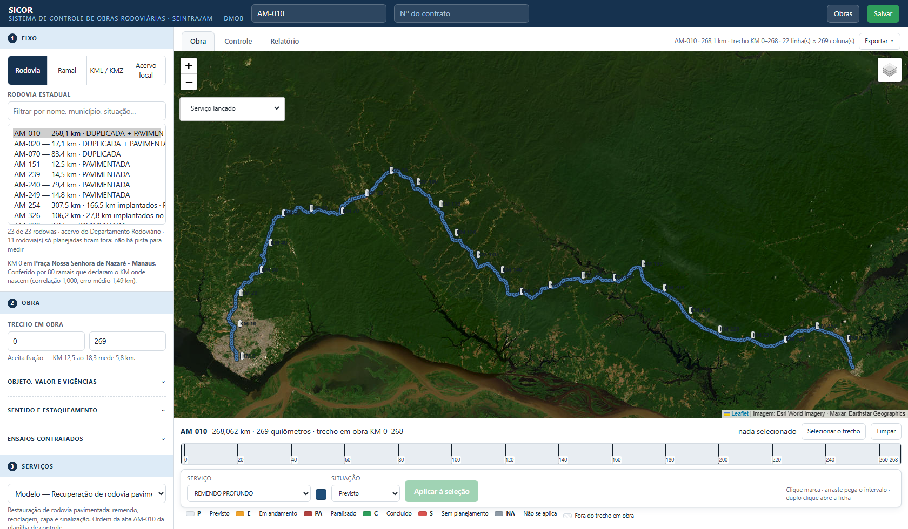
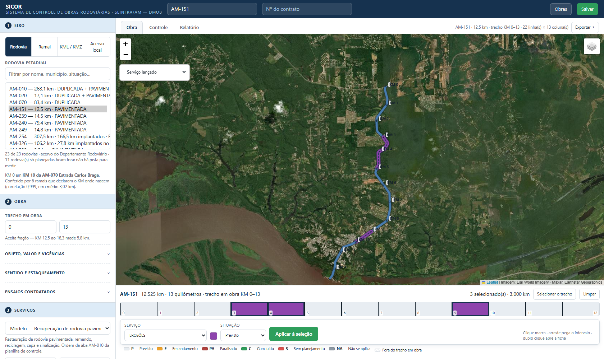
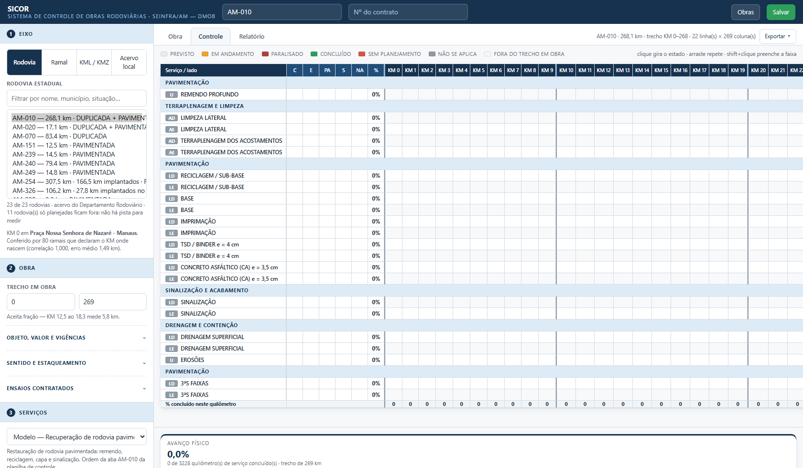
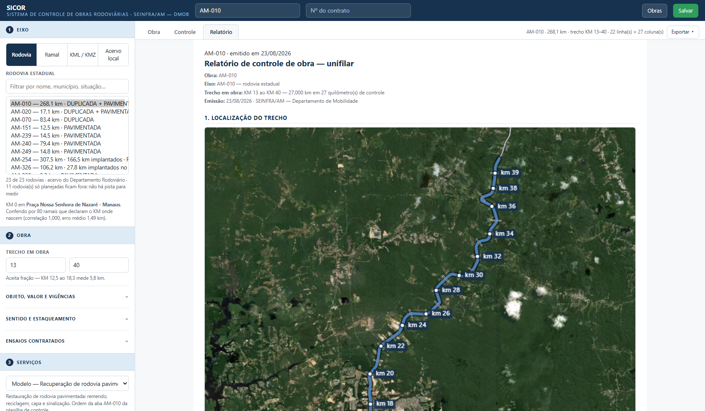

# Manual de uso — SICOR

Sistema de Controle de Obras Rodoviárias

SEINFRA/AM · Departamento de Mobilidade

Este manual é para quem vai operar a plataforma. A parte técnica (como o acervo é gerado, como
o cálculo é conferido) está no [README](../README.md).

---

## 1. Abrir a plataforma

Publicada no GitHub Pages, basta abrir a URL. Rodando na máquina, abra o terminal na pasta do
projeto e execute:

```
python -m http.server 8000
```

Depois abra `http://localhost:8000` no navegador. Se a plataforma for aberta com dois cliques
no `index.html`, ela avisa e não carrega: o navegador bloqueia a leitura da pasta `dados/` em
`file://`.

Nada é enviado para fora da máquina. O que você lança fica gravado no navegador e volta
sozinho na próxima abertura.

---

## 2. Escolher o eixo da obra



A lateral tem três passos: **1 Eixo**, **2 Obra**, **3 Serviços**. O que se usa a toda hora
fica à vista; o que se preenche uma vez por obra fica em grupos recolhidos, com uma seta do
lado — um clique abre, e a seta gira.

No passo **1 — Eixo** há quatro origens:

- **Rodovia** — as rodovias estaduais **que têm pista implantada**. São 23 das 34 do
  cadastro: rodovia inteiramente planejada não entra, porque não existe pista onde medir, e a
  lista diz quantas ficaram fora. Duas continuam ali com aviso — AM-326 e AM-366 —, porque o
  cadastro registra pista implantada nelas (27,8 km e 17,0 km) que o traçado do acervo não
  tem; o rótulo avisa: *«implantados no cadastro, sem traçado»*.
- **Ramal** — os 905 ramais, com filtro por nome, município ou rodovia de referência.
- **KML / KMZ** — arraste o arquivo do seu projeto. O arquivo é lido pelo próprio navegador.
- **Acervo local** — traçados que você guardou neste navegador, com o botão *Guardar no
  acervo local* que aparece depois de carregar um KML/KMZ. Para tirar um da lista, escolha-o
  e use *Remover do acervo local* — o projeto que já usa aquele traçado continua com ele
  dentro.

Ao escolher, a plataforma divide o traçado do KM 0 até a extensão final e desenha no mapa. O
campo de filtro aceita nome, município ou situação (por exemplo, `manacapuru` ou `pavimentada`).

### Confira o KM 0

Logo abaixo da lista do acervo a plataforma diz de onde vem o KM 0 daquele eixo — por
exemplo: *«KM 0 em Praça Nossa Senhora de Nazaré – Manaus. Conferido por 80 ramais que declaram
o KM onde nascem (correlação 1,000, erro médio 1,49 km)»*.

Quando aparecer **«Sentido não verificado»**, olhe o croqui e confirme de que lado está o KM 0.
Três rodovias estaduais estão nessa situação (AM-175, AM-280 e AM-329), e qualquer KMZ
carregado pelo usuário também: um arquivo de traçado não carrega essa informação. O botão **Inverter
sentido**, no grupo **Sentido e estaqueamento** do passo 2, troca a ponta.

> Inverter apaga os lançamentos, e a plataforma pede confirmação antes. Não é zelo excessivo:
> com o sentido trocado, a coluna «KM 12» passa a ser outro ponto da rodovia, e manter o
> preenchimento transferiria serviço executado para o trecho errado.

### Veja quanto do eixo é implantado

O cadastro registra trecho que ainda não foi construído. No seletor, o eixo que tem trecho
planejado mostra **quanto é implantado** (por exemplo, *«AM-254 — 307,5 km · 166,5 km
implantados»*), e o que não tem nenhum aparece como *«planejada»*.

Ao escolher, a plataforma avisa em que quilômetros está o planejado. Vale para o que você vai
medir: **recuperação só se mede onde há pista**. Em eixo planejado a obra é de implantação —
troque o catálogo de serviços no passo 3 (ver a seção 4).

---

## 3. Obra: trecho, contrato e o que fica recolhido

Passo **2 — Obra**. À vista fica só o **trecho em obra**; o resto está em quatro grupos
recolhidos, porque são coisas que se preenchem uma vez por obra e não a cada lançamento:

| Grupo | O que tem dentro |
|---|---|
| **Objeto, valor e vigências** | a identidade contratual (seção 6) |
| **Sentido e estaqueamento** | referência das colunas, inverter sentido, estaca inicial |
| **Ensaios contratados** | quais ensaios a obra controla (seção 7) |

- **Referência das colunas** — alterna entre **Quilômetro** e **Estaqueamento**. Em estaca, as
  colunas passam a 0, 50, 100, 150… (1 estaca = 20 m, então o KM 1 abre na estaca 50).
- **Trecho em obra** — KM inicial e KM final, à vista no passo 2. A obra pode ocupar só parte
  da rodovia. Fora do trecho a célula fica hachurada e não aceita lançamento, e o croqui passa
  a enquadrar o trecho, deixando o resto do eixo em linha fina.
- **Estaca do início do eixo** — use quando o estaqueamento do projeto não começa em zero. O
  valor é somado a todas as estacas.

---

## 4. Escolher os serviços

Passo **3 — Serviços**. Primeiro escolha o **catálogo**, porque obra de recuperação e obra de
implantação não têm os mesmos serviços:

| Catálogo | Serviços | Para que serve |
|---|---|---|
| **Recuperação (padrão AM-010)** | 12 | Rodovia já pavimentada: remendo, limpeza, reciclagem, base, capa, sinalização, erosões, 3ªs faixas |
| **Implantação (padrão AM-070)** | 9 | Pavimentação nova: O.A.C., terraplenagem, sub-leito, sub-base, base, imprimação, reciclagem, pintura de ligação, CBUQ |

Os dois vêm da planilha de controle da SEINFRA, cada um na ordem em que a planilha os
apresenta. Marque só os serviços que a obra contrata: cada serviço marcado abre uma ou mais
linhas na matriz, conforme os lados que ele ocupa.

Trocar de catálogo troca a lista da matriz. Os lançamentos do catálogo anterior **não são
apagados** — ficam guardados e voltam se você retornar a ele. Se já houver lançamento, a
plataforma pede confirmação antes de trocar.

| Lados | Significado |
|---|---|
| `U` | Pista única — uma linha só |
| `LD` · `LE` | Faixa direita e faixa esquerda — duas linhas |
| `AD` · `AE` | Acostamento direito e esquerdo — duas linhas |

Botões **Marcar todos** e **Desmarcar** ajudam a partir do extremo mais próximo do contrato.

---

## 5. Lançar pela faixa unifilar



É por aqui que se trabalha no dia a dia. Embaixo do mapa, o traçado aparece esticado numa
linha reta, dividido em quilômetro (ou em estaca), com divisa preta entre eles.

1. **Selecione** os quilômetros: clique para marcar, arraste para pegar um intervalo,
   `Shift` + clique para estender do último marcado. A seleção pode ser **descontínua** —
   erosão acontece no KM 4 e no KM 9, e não entre eles. Clicar no mapa também marca.
   *Selecionar o trecho* pega tudo que está dentro do trecho em obra.
2. **Escolha o serviço** na barra abaixo. O quadradinho ao lado mostra a cor dele.
3. **Escolha o lado**, quando o serviço tem faixa direita e esquerda ou acostamentos.
4. **Escolha a situação**: Previsto, Em andamento, Paralisado, Concluído, Sem planejamento,
   Não se aplica.
5. **Aplicar à seleção**. Os quilômetros ficam pintados com a cor do serviço, na faixa e no
   mapa. Quando há mais de um serviço no mesmo quilômetro, a célula aparece em listras.

**Duplo clique** num quilômetro abre a ficha técnica dele (item 7).

O trecho em obra aceita valor quebrado: KM 12,5 a 18,3 mede 5,8 km, e o quilômetro da ponta
entra pelo pedaço que é obra — não pelo quilômetro cheio.

---

## 6. Identificação do contrato

Passo **2 — Obra**, no grupo **Objeto, valor e vigências**. É o que faz a obra ser rastreável
ao processo, e é assim que o relatório abre.

- **Objeto**, como está no contrato.
- **Valor**.
- **Vigência do contrato** e **vigência de execução** — as duas, porque não coincidem.

> **Quantidade contratada por serviço saiu desta versão.** A plataforma está para acompanhar o
> andamento da obra, não para medir contrato: medição é outro trabalho e vem em outro momento.
> Quem já tinha informado quantidade não perdeu nada — o número continua guardado dentro do
> projeto e volta quando a medição voltar.

O quadro da obra mostra **% do trecho**: onde a obra está ao longo do eixo em obra. A coluna
«% do contrato» saiu com a quantidade contratada, e volta com ela.

O **quadro de avanço por serviço** sai no relatório em quilômetros, e um quilômetro conta uma
vez por serviço, **pelo estado menos avançado entre os lados**: com a faixa direita concluída e
a esquerda não, aquele quilômetro ainda tem o que fazer, e contá-lo como concluído seria meio
serviço virando serviço inteiro num documento que instrui medição. Somar os dois lados também
não serve: dobraria a extensão da obra.

---

## 7. Ficha técnica do quilômetro

Duplo clique num quilômetro da faixa, ou no mapa. A ficha traz:

- **Identificação**: quilômetro ou estaca, extensão real do segmento, coordenadas de início
  e fim, e aviso quando está fora do trecho em obra.
- **Serviços** lançados ali, com a situação de cada um.
- **Ensaios de controle tecnológico**: ensaio, norma de referência, medição, critério
  aplicado, resultado, data, responsável e foto.
- **Lançar ensaio**: escolha o ensaio (dos marcados no grupo **Ensaios contratados**, no
  passo 2 da lateral), informe a
  medição, confira o critério — vem do catálogo e é editável —, o responsável e, se quiser,
  a foto. A foto é reduzida antes de ser guardada.

O critério é **copiado para dentro do registro** no momento do lançamento. Se o catálogo
mudar depois, o ensaio já aceito não é reprovado retroativamente.

Os botões *anterior* e *próximo* passam de quilômetro em quilômetro sem fechar a ficha.

> **Norma pendente.** Onde o catálogo ainda não tem a norma conferida na fonte, a plataforma
> escreve «norma pendente» em vez de exibir um código não verificado, e o relatório avisa
> quantos ensaios estão nessa situação. Número de norma errado em fiscalização de contrato
> não é detalhe.

---

## 8. Obras guardadas por contrato

O contrato é a identidade da obra. Preencha o **Nº do contrato** no cabeçalho e abra
**Obras** — o painel tem a lista, a busca por contrato, obra ou eixo, e três ações:

| Ação | O que faz |
|---|---|
| **Guardar esta obra** | guarda o que está na tela sob aquele número de contrato |
| **Abrir arquivo…** | abre um `.json` de projeto ou um pacote CDE `.zip` vindo de fora |
| **Nova obra** | limpa a tela para começar outra |

Clicar numa obra da lista devolve o perfil dela — traçado, serviços, lançamentos e ensaios
como estavam.

Isso fica **no navegador desta máquina**. Não substitui o arquivo: use **Salvar** para gerar
o `.json` que se anexa ao processo ou se envia a um colega. Limpar os dados de navegação
apaga a lista.

---

## 9. Matriz de controle



Aba **Controle**. A grade abre primeiro — uma linha por serviço e lado, uma coluna por
quilômetro, como a planilha da equipe —, e os cartões e gráficos do painel ficam logo abaixo.
A legenda das situações fica em cima da grade, e o cabeçalho traz uma marca mais forte a cada
10 km, para não se perder a conta em 269 colunas.

Cada célula é um serviço, num lado, num quilômetro. **Clique na
célula** para girar o status; **arraste** para repetir nas seguintes o status que acabou de
aplicar, que é como se pinta uma faixa inteira sem dar um clique por quilômetro. A coluna de
serviço fica fixa: rolar até o KM 130 não faz perder de vista o que se está lançando, e
marcar um quilômetro na faixa (aba **Obra**) leva a grade até ele. A ordem do clique põe **Concluído** primeiro porque é o
lançamento mais frequente; continuar clicando passa pelos demais e volta a Previsto:

| Clique | Status | Cor | Quando usar |
|---|---|---|---|
| — | **Previsto** | cinza claro | planejado, não iniciado |
| 1º | **Concluído** | verde | concluído e conferido |
| 2º | **Em andamento** | laranja | em execução no quilômetro |
| 3º | **Paralisado** | vermelho-escuro | frente aberta e parada |
| 4º | **Sem planejamento** | vermelho | quilômetro sem planejamento no período |
| 5º | **Não se aplica** | cinza | serviço não aplicável ao quilômetro |
| 6º | volta a **Previsto** | | |

O avanço físico conta apenas o que está **Concluído**; *Não se aplica* sai do denominador.

O giro passa pelos seis estados, **Paralisado** incluído — ele entrou no ciclo em 23/08,
porque era o único estado do catálogo que não se conseguia marcar na grade, e é o primeiro que
o pedido do cliente nomeia. A contagem dele aparece na coluna **PA**.

A coluna **%** de cada linha mostra o avanço do serviço no trecho, e o cabeçalho de cada
quilômetro traz a extensão real do segmento. Clicar num quilômetro no mapa leva à coluna
correspondente na matriz.

---

## 10. Croqui do trecho


A imagem é montada sozinha quando o eixo entra e refeita quando o trecho muda: traçado sobre
imagem de satélite, marcação de quilômetro, escala gráfica, identificação da obra e crédito da
imagem. O que está fora do trecho aparece em linha fina, para situar a obra dentro da rodovia,
e o traçado é pintado pela cor do avanço de cada quilômetro.

Ela abre a primeira seção do **relatório** e vai dentro do **pacote CDE**, em arquivo
separado. Se não houver internet, o croqui sai com fundo neutro: perde a foto de satélite,
não o traçado.

Para levar a imagem a um ofício ou a uma apresentação: **Exportar → Croqui em PNG**. Se a
imagem ainda não tiver sido montada, o botão monta na hora e baixa; o arquivo sai com o nome
da obra.

---

## 11. Resumo e relatório

Os cartões de resumo — avanço físico e a contagem de quilômetros por situação — ficam na aba
**Controle**, logo abaixo da grade. Todos os números de avanço da plataforma saem da mesma
régua: **um quilômetro conta 1 por serviço, pelo estado menos avançado entre os lados**. Se a
faixa direita está concluída e a esquerda não, aquele quilômetro ainda tem o que fazer.

Aba **Relatório** — o documento fechado, aberto pela identificação do contrato, em
seções: *Localização do trecho* (o croqui),
*Avanço geral*, *Situação por serviço*, o *unifilar impresso* (uma barra por serviço e lado,
cor por situação, régua de quilômetro embaixo — a relação faixa a faixa continua completa no
CSV e no pacote CDE), *Controle tecnológico* — quadro por tipo de controle e a
relação dos ensaios com norma, critério, resultado, responsável e foto — e *Notas técnicas*,
onde ficam a extensão cadastrada, a extensão apurada na geometria, a origem da quilometragem
e as descontinuidades do traçado. A seção de controle tecnológico só aparece quando há ensaio
lançado.



As saídas ficam no menu **Exportar**, na barra das abas:

- **Imprimir** — abre o diálogo do navegador; escolha «Salvar como PDF» para gerar o
  arquivo. O documento sai em A4 paisagem, com cada seção em página nova, o cabeçalho de cada
  tabela repetido nas páginas seguintes e um rodapé com contrato, obra e data de emissão em
  toda folha — folha solta continua rastreável ao contrato.
- **Exportar CSV** — a matriz inteira, uma linha por serviço e lado, uma coluna por quilômetro,
  para abrir no LibreOffice ou no Excel. É aqui que sai a relação faixa a faixa completa.
- **Pacote CDE** — o `.zip` para o ambiente comum de dados: eixo em GeoJSON e KML, matriz e
  ensaios em CSV, fotos, croqui e o projeto reabrível.
- **Croqui em PNG** — a imagem do trecho, com o nome da obra no arquivo.

---

## 12. Salvar e retomar

- **Salvar**, no cabeçalho — grava um arquivo `.json` com o eixo, o trecho, os serviços e
  todos os lançamentos. É esse arquivo que se anexa ao processo ou se envia a um colega.
- **Abrir arquivo…**, dentro de **Obras** — carrega um `.json` salvo ou um pacote CDE `.zip`.
- **Nova obra**, dentro de **Obras** — limpa tudo e começa outra obra.

> **Tarja vermelha no cabeçalho, «NÃO ESTÁ SENDO GUARDADO»:** o armazenamento do navegador
> encheu e o salvamento automático parou. O que está na tela continua valendo, mas existe só
> nessa aba — **use Salvar imediatamente**. Tarja âmbar «Fotos sem espaço» quer dizer que o
> projeto está guardado e as fotos dos ensaios não; salvar em arquivo leva as fotos junto.

O trabalho em andamento também fica gravado no navegador e volta sozinho na próxima abertura —
mas o navegador não é arquivo morto: para guardar, use **Salvar**.

---

## Perguntas que aparecem

**A extensão que a plataforma mostra difere da extensão do cadastro.**
As duas aparecem nas notas técnicas do relatório. A diferença é o desvio entre a geometria
disponível e a extensão cadastrada — na AM-010, 268,062 km medidos contra 268,250 km de
cadastro, 0,07%. Para controle por quilômetro isso não muda nada; se a obra é medida por
cadastro, use o número do cadastro no documento contratual.

**A rodovia tem um vazio no traçado.**
Acontece em rodovia com travessia de balsa ou trecho ainda não cadastrado em geometria. A
plataforma **não** emenda por cima do vazio (somar o salto inflaria a rodovia), e as notas
técnicas do relatório listam cada descontinuidade. A quilometragem segue contando do outro lado.

**Carreguei um KMZ e o KM 0 saiu na ponta errada.**
Normal: o arquivo não traz essa informação. Use **Inverter sentido**.

**Preciso de um serviço que não está no catálogo.**
Para uma obra só, use o grupo **Acrescentar serviço**, no fim do passo 3. Para valer em todas, o
catálogo está em `dados/catalogo-servicos.json`, dentro do conjunto (`recuperacao` ou
`implantacao`) a que o serviço pertence — é arquivo de texto, com serviço, grupo, lados e
unidade.
